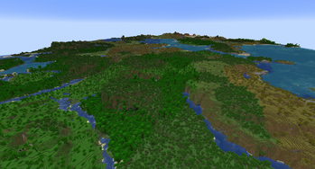
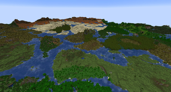
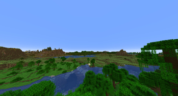
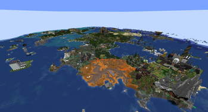

> **Language:** Русский · [English](README.en.md)

# Nvidium (Minecraft 1.21.4 Fabric)


Сборка и оптимизация движка рендеринга **Nvidium** для **Minecraft 1.21.4 (Fabric)**.

Источник: [GitHub: MCRcortex/nvidium](https://github.com/MCRcortex/nvidium).

---

## О моде

**Nvidium** — альтернативный высокопроизводительный движок рендеринга для **Sodium**, использующий аппаратные возможности видеокарт NVIDIA (архитектура Turing и новее) для отрисовки огромных дистанций мира при сверхвысоком FPS.

---

## Галерея

| Обзор рендеринга | Дальняя прорисовка |
|:---:|:---:|
|  |  |
|  |  |

---

## Возможности

- Аппаратный mesh shading рендеринг геометрии чанков на видеокартах NVIDIA.
- Экстремально высокая дальность прорисовки (до 64+ чанков) с плавным фреймрейтом.
- Полная интеграция с графическими настройками Sodium.
- Поддержка полупрозрачных блоков и многослойной сортировки.

---

## Что изменено в сборке (byMr712)

- **Исправлена утечка OpenGL-состояний при переподключении**: устранены баги с черными сущностями, черными предметами в REI и прозрачностью моделей игроков при повторном входе на сервер или перезаходе в мир (добавлен корректный сброс текстурных слотов, сэмплеров, UBO-диапазонов и шейдеров).
- **Синхронизация с кэшем Blaze3D**: прямые вызовы `glBindTextureUnit` заменены на `GlStateManager`, предотвращая рассинхронизацию текстурных слотов с игровым движком.
- **Очистка состояния конвейера**: обеспечен полный сброс активных программ шейдеров (`glUseProgram(0)`) и буферов после проходов рендеринга и при удалении пайплайна (`RenderPipeline.delete()`).
- **Скрипт сборки**: добавлен скрипт быстрого билда `build.bat`.

---

## Требования и установка

1. Требования:
   - [Sodium](https://modrinth.com/mod/sodium) 0.6.13
   - Видеокарта NVIDIA GeForce GTX 1600 серии или новее (архитектура Turing, Ampere, Ada Lovelace, Blackwell)
2. Скачайте `.jar` файл и поместите в папку `mods`.
3. Запустите игру.

---

## Сборка

1. Требуется Java 21 и Fabric Loader для Minecraft 1.21.4.
2. Для сборки выполните:
   ```bash
   ./gradlew build
   ```
3. Собранный файл находится в `build/libs/Nvidium-1.21.4-byMr712.jar`.

---

## Авторы и лицензия

- Оригинальный автор: [MCRcortex](https://github.com/MCRcortex) ([nvidium](https://github.com/MCRcortex/nvidium)).
- Портирование на 1.21.4: [drouarb](https://github.com/drouarb) ([Shays-Forks/nvidium](https://github.com/Shays-Forks/nvidium/tree/1.21.4)).
- Исправления и сборка: [Mr712](https://github.com/byMr712).
- Распространяется под лицензией [LGPL 3.0](LICENSE.txt).